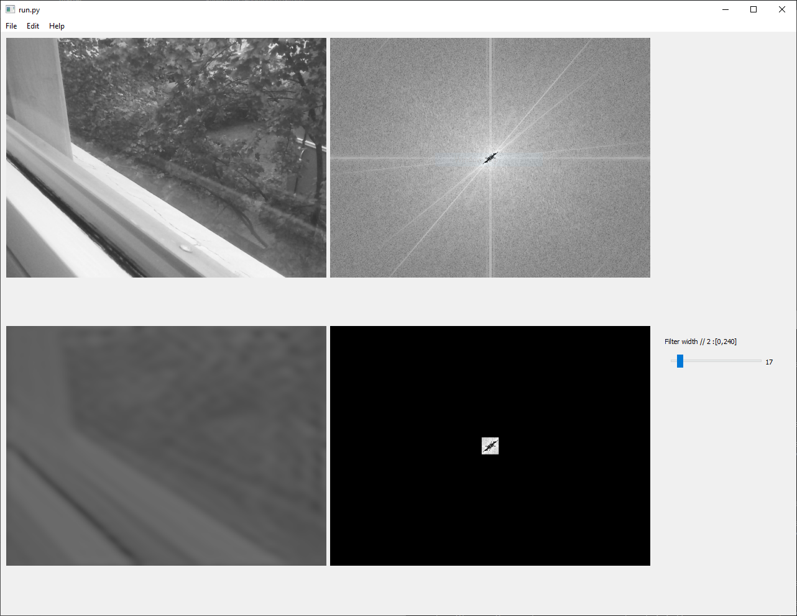

# vid2fft
SOL4Py PyQt5 OpenCV program demonstrating 2D Discrete Fourier Transform and square filtering in frequency domain of your webcam

## Dependencies
As specified in:
http://www.antillia.com/sol4py/library.html

SOL4Py-3.1 for Python3.6, PyQt5, OpenGL, OpenCV-4.1.0, ML, CNN(Keras, Torch) YOLOv3, SSD and Oracle12C (20 Sep. 2019)

or:
```bash
conda install numpy
conda install opencv
conda install PyQt5
conda install pydotplus
conda install -c conda-forge qimage2ndarray
conda install pydot
conda install PyOpenGL
```
and likely some other packages that you will find out to be needed on your system.

## Run
```bash
python run.py
```

